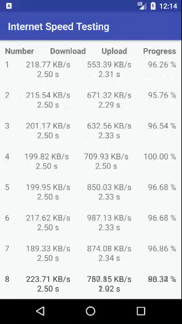

# Internet Speed Testing Library
This library base on https://github.com/bertrandmartel/speed-test-lib

To include in your project, add this to your build.gradle file:
```groovy
//build.gradle [project module]

allprojects {
    repositories {
        jcenter()
        maven { downloadUrl "https://jitpack.io" }
    }
}
```


```groovy
//build.gradle [app module]

implementation 'com.github.oatrice:internet-speed-testing:1.0.2'
```



## Usage
```java
private void testSpeed() {
        InternetSpeedBuilder builder = new InternetSpeedBuilder(this);
        builder.setOnEventInternetSpeedListener(new InternetSpeedBuilder.OnEventInternetSpeedListener() {

            @Override
            public void onDownloadProgress(int count, ProgressionModel progressModel) {

            }

            @Override
            public void onUploadProgress(int count, ProgressionModel progressModel) {

            }

            @Override
            public void onTotalProgress(int count, ProgressionModel progressModel) {
                adapter.setDataList(count, progressModel);
                if (oldPosition < count) {
                    oldPosition = count;
                    recyclerView.smoothScrollToPosition(count);
                }
            }

            @Override
            public void onUploadError(@NotNull SpeedTestError speedTestError, @NotNull String errorMessage) {

            }

            @Override
            public void onDownloadError(@NotNull SpeedTestError speedTestError, @NotNull String errorMessage) {

            }
        });

        /*builder.startDownloadUpload(
                "http://2.testdebit.info/fichiers/1Mo.dat",
                "http://2.testdebit.info/",
                20);*/

        // Download and Upload 20 times
        // Fixed duration 3 second
        builder.startDownloadUpload(
                "http://2.testdebit.info/fichiers/1Mo.dat",
                "http://2.testdebit.info/",
                20,
                2500,
                2500);
    }
```

## Contributing
Suggestions and pull requests are highly encouraged.
