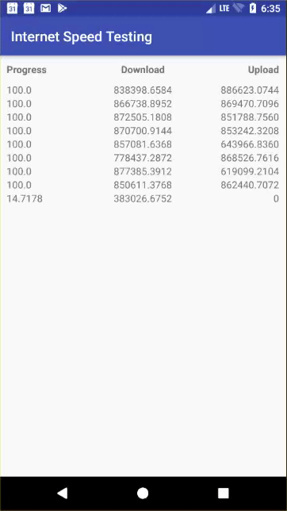

# internet-speed-testing
This library base on https://github.com/bertrandmartel/speed-test-lib

To include in your project, add this to your build.gradle file:
```
implementation 'com.github.oatrice:internet-speed-testing:1.0.1'
```



## Usage
```
InternetSpeedBuilder builder = new InternetSpeedBuilder(this);
        builder.setOnEventInternetSpeedListener(new InternetSpeedBuilder.OnEventInternetSpeedListener() {
            @Override
            public void onDownloadProgress(int count, ProgressionModel progressModel) {

            }

            @Override
            public void onUploadProgress(int count, ProgressionModel progressModel) {

            }

            @Override
            public void onTotalProgress(int count, ProgressionModel progressModel) {
                adapter.setDataList(count, progressModel);

            }
        });
        builder.start("http://2.testdebit.info/fichiers/1Mo.dat", 2);
```

## Contributing
Suggestions and pull requests are highly encouraged.
